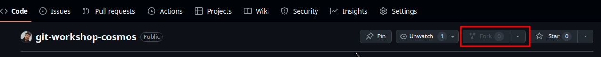

# Git Workshop Assignment
**December 07, 2024**

Congratulations on successfully completing the 2-day Git workshop! To receive your digital certificate, you are required to complete the following assignment. This is a compulsory task.

## Step-by-Step Instructions

1. **Fork the Repository**:
   
   Fork the following repository to your GitHub account:  
   [https://github.com/ujjwalnp/git-workshop-cosmos](https://github.com/ujjwalnp/git-workshop-cosmos)

   

2. **Clone the Repository**:
   
   Clone your forked repository using the command:
   ```bash
   git clone https://github.com/your-username/git-workshop-cosmos.git
   ```

3. **Create a Branch**:
   
   Create a new branch with your name. Replace `your-name` with your actual name (use hyphens instead of spaces if needed):
   ```bash
   git branch your-name
   git checkout your-name

   or,

   git checkout -b your-name
    ```

4. **Edit `about.txt`**:
   
   In the repository, locate the `about.txt` file.
   Open `about.txt` in a text editor and add your name and a brief bio about yourself. The format should be:
   ```bash
    Name: [Your Name]
    Bio: [A brief bio about yourself]
    ```

5. **Commit Your Changes**:
   
   Stage and commit your changes with a meaningful commit message:
   ```bash
   git add about.txt
   git commit -m "Added bio for [Your Name]"
    ```

6. **Push to Your Branch**:
   
   Push your changes to the repository:
   ```bash
   git push origin your-name
    ```

7. **Create a Pull Request**:

    Go to the GitHub repository and create a pull request from your branch to the main branch.
    Ensure your pull request title is your name and includes a brief description of the changes made.

    

## Submission Deadline
The assignment must be completed and the pull request must be created by **December 12, 2024**.

## Evaluation Criteria
Your submission will be evaluated based on the following criteria:

- Correctly following the assignment steps.
- Accurate and complete information in the about.txt file.
- Timely submission of the pull request.

## Support
If you encounter any issues or have any questions, feel free to reach out to the support team at [ictclub@cosmoscollege.edu.np](mailto:ictclub@cosmoscollege.edu.np).

## Certificate of Completion
Participants who successfully complete the assignment will receive a digital certificate of completion via email.

## Additional Notes
If you face any issues while pushing code, you may need to configure SSH or use another authentication method. For assistance, refer to the following documentation:
- [Connecting to GitHub with SSH](https://docs.github.com/en/authentication/connecting-to-github-with-ssh)
- [Creating a Personal Access Token](https://docs.github.com/en/authentication/keeping-your-account-and-data-secure/creating-a-personal-access-token)